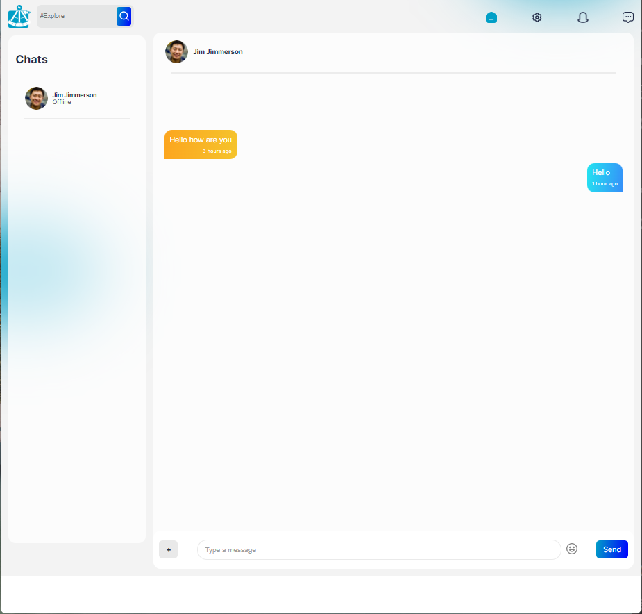

##  Radar

Building a full feature social media app in React! With Express, NodeJS, MongoDB and Socket.io

---

## How It's Made

**Tech used:** React, Express, NodeJS, MongoDB, Socket.io, React-Input-Emoji, JSX, HTML, CSS, JavaScript

Made in React, with Express, NodeJS, MongoDB on the backend and Socket.io for the chat. Images uploaded are currently saved to local storage. Upcoming enhancement to store them in firebase, in real time.
Chat functionalilty courtest of socket.io.

### Features and Functionality

| _Feature_               | _Description_                                 |
| ----------------------- | --------------------------------------------- |
| **Register**            | Register a new account                        |
| **Login**               | Log into your account                         |
| **Update User Profile** | Update your user profile, add images and text |
| **Post**                | Post a picture, a text response, or both!     |
| **Follow Users**        | Follow other users to see their posts         |
| **UnFollow Users**      | Retract your following of a user              |
| **Initiate New Chat**   | Start a new Chat with existing users          |
| **Chat**                | Chat with existing users                      |

---

## Optimizations

- Add Firebase hosting for the images, for a real multi-user experience.
- Create a real time Trending board that updates automatically on usages of tags.
- Add a Settings page to update password, email and other user settings.
- Add a 'Start Chat' feature where you can message any user from scratch.

---

## Lessons Learned:

Integrating socket.io with also hosting the messages on MongoDB, and how to keep them synced was interesting!
